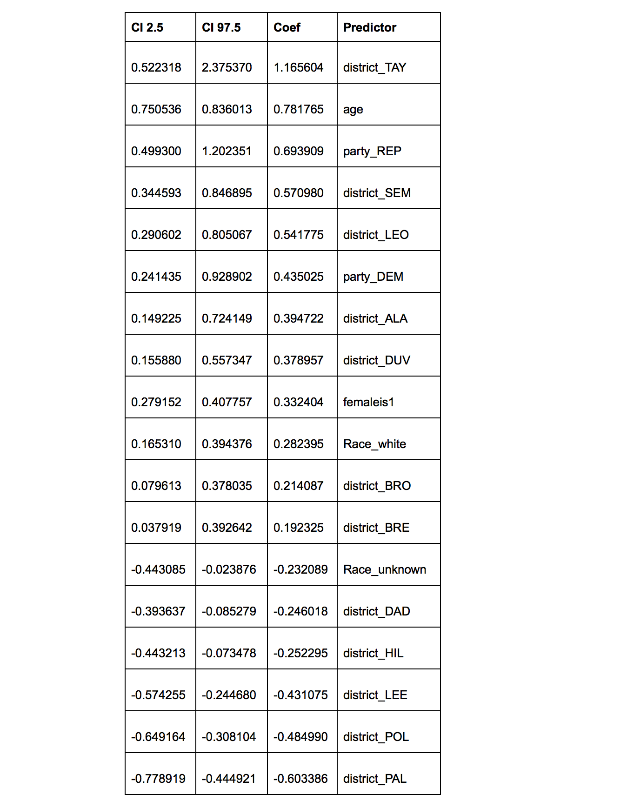

## 1 / Problem Statement and Motivation

Welcome to the Voter Turnout CS109 Data Science Project. Race and ethnicity have long played a role in American politics. While white or caucasian turnout to the voting polls has eclipsed minority turnout for centuries, minorities hit historic turnout during President Barack Obama’s presidential election. This increased focused on ethnicities and race in predicting election results is compounded by the growing diversity of our nation’s population.

Our goal is to build a classification model that predicts an individual’s voter turnout in the general election, given a set of features that are available in or can be derived from public voting records. Specifically, we want to draw conclusions about and better understand the voting behaviors of minorities.

#### Problem Statement 
Can we:
1. Use a baseline model, built only with data given by the state of Florida, that predicts an individual’s voter turnout? 
2. Enhance this prediction model by imputing ethnicity
- Imputation of a person’s ethnicity using a more general classification (i.e. Jewish, Western European, etc). 
- Imputation of a person’s ethnicity using more precise ethnicity and 
3. Determine which variables are most useful in predicting voter turnout
4. See voter turnout trends between demographic groups / ethnicities

 
#### Motivations

**Voter-turnout**: This is the ultimate measure of political participation in America. By researching what factors affect voter-turnout, we also learn about which members of our electorate are the most politically engaged, and how various demographic features shape individuals’ political-activeness.

**Ethnicity**: Politicians often view ethnicities as blocs of people with similar political attitudes. For example, George W. Bush ran a series of famous Spanish-language ads in Florida in the 2000 election, to win over the “Latino vote”. We want to test the assumptions that politicians have about the voting behaviors of different ethnicities.

**Florida**: We chose Florida as our state of analysis because (1) it is a swing state, (2) it is very diverse, with a sizeable minority population, (3) has differences in voting behavior among its counties. Also, the State of Florida makes their voting records available to the public for free, so that’s a plus (as other states often charge above $1000 for their voter files).

## 2 / Introduction and Description of Data

#### High-level Overview

We will explore and test our hypothesis through the following method:

* Initial EDA
* Create a turnout prediction **baseline model** (that predicts based on the dataset)
* Create an ethnicity imputer (that classifies an ethnicity based on name)
* Test to see if the imputed ethnicity enhances our turnout prediction (**ensemble model**)
* Optimize ethnicity imputation and turnout prediction models to increase performance

One of our **central hypotheses** is that the imputation of ethnicity can strengthen our model in a significant way, because of the cultural propensities between ethnic groups. We are not sure if this is the case, but it is an intuition that many politicians hold, so it is worth testing. Our research here will hopefully offer some insight.

#### Our Dataset: Florida Voting Records

Through an official public information request to the Florida government, we had acquired the complete voting records for the State of Florida for the past 11 years. Florida was an ideal choice for analysis because its diversity in political attitude, minority composition, and easy-to-obtain data.

The figure below shows the racial diversity of Florida:

Each zip code is colored by the percent minority registered voters. As you can see, south Florida has almost entirely minority communities. Southern Florida is diverse (large minority populations) while the counties north and inland tend to vary or be predominantly white.

#### Voter Records: 2 Parts

For each county, we have two files: (1) a **Voter Registration record**, and (2) a **Voter History record**.

##### Voter Registration

This contains personal information about the voter, such as their address, district, date of birth, gender, etc. 

Many of these columns (like Precinct, District, City, & Zip Code) could be derived from each other and had limited unique predictive value, so we eliminated them. There were other columns (like Phone Number and Email Address) that would not have helped us predict either, so they were eliminated.

These datasets were huge (>10GB) so eliminating redundant columns was an important step to make sure we don’t max out our RAM when doing operations. As one may expect, the size of the dataset caused us to accidentally collect a sample that was not representative of the population. The data cleaning had to be performed prior to sampling. Given the size of the data, the cleaning took approximately two days. 

##### Voter History

We also had records of every ballot cast in the past 85 elections in Florida from 2006-2016 in our Voter History file for each county. Each vote cast was linked by ID (e.g. 100005820) to a person in the previously mentioned Voter Registration file.

#### Data Cleaning

The first step we took in data cleaning was to merge the two files. We merged on id as upon look at the two data sets we saw that each voter had an id which was unique and this id was in both file to represent that particular voter. This merge was also done to capture all registered voters in the state regardless of whether he/she voted in a particular election. If the individual did not vote he/she would have an NaN under the election data column (number 22 below). Upon merging we have 250 million rows of voters for the entire state so we quickly moved on to drop column that we deemed were represented by other columns or not predictive of voter turnout. For example we dropped street address as it is not really relevant to whether the individual will voter and is specific to each voter whereas we kept zip code because zip code can represent entire demographic or ethnicity and thus can play a role in voter turnout. Similarly we dropped middle name as we already have ID to identify the use and first and last name thus keeping it would be repetitive. Below is an image of the data frame after this cleaning.

We knew that this was still a huge data set to work with and it contained a lot of duplicates. Thus we moved on to further clean the data by reducing the data to just include the general election by removing instances of “PPP (special, local, etc.), “PRI” (Primary Elections), and “OTH” (Other). The data was reduced to include only general elections because historically the the general election has the highest turnout and because Florida has a closed primary which heavily affect the primary elections voter turnout. Below is an image of what the data set looked like after this cleaning.

As you can see above Jaqueline votes frequently thus appear multiple time in the data set thus our next step was to intelligently had these duplicates such that each voter has only a single row! In order to do this we created column for each general election i.e "GEN16" and "GEN12" and indicated in this column whether the individual voted or not. This voted or not was determined by looking at the typeofvote section and filling it in the correct election column. Furthermore NaN were not removed as they represent individual that registered but did not vote which we thought was relevant thus NaN were instead turned into 0 and a vote was turned into 1 as shown in the second image below.

Upon doing the above clean where an individual would have a ‘1’ if he or she voted, made us notice some inconsistencies in the data where we notice that individual can move district or switch political parties in between two election i.e general 2012 and general 2016. Thus we decide to employ the same clean method as described above but focus solely on 2016 thus removing the issue of voter changing district or parties. However, given more time we would like to look at each individual year i.e 2012. In addition, based off of "date of birth" we decided to add a column called age to the data set so that we can see how voter turnout in various ethnicities varies later in our model. Lastly we choose to subsample the 10 million+ rows data set into a 100 000 samples, as logistic regression is a parametric test requiring a large sample size. We will also be using a large number of dummy variables, so our sample size needed to be larger than our number of predictors.

Below shown is an image of our data with the newly created age column:

In this particular study, NaNs are data-rich. For example, NaNs in the column “general” or “GEN16” meant that a registered voter had not voted in the election due to the merging between Voter History data and Registered Voter data. The NaN was later replaced with 0 so that a classification of 0/1 may be predicted later. Once the data was reduced to only the columns relevant for our analysis (age, race, district, political party, and voted/not), we randomly sampled 150,000 registered voters from the dataset. This was then further split to 100,000 for training and validation, and 50,000 for the final test analysis. The 150,000 sample had 431 missing values in our “age” variable. Before dropping these rows, we assessed whether there could have been an error in a particular county during voter registration collection especially since voter registration has historically been by hand. A closer look demonstrated that no more than 3% of any district was missing “age,” suggesting that the missing data is fairly evenly distributed across our counties and in relatively few instances. We feel comfortable that dropping these registered voters (rows) would maintain a representative sample of the population. The only other rows containing missing values relevant for our analysis was “First Name,” which was missing only twice in our 150,000 sample, and gender which was missing 10 times. Given the overall size of the dataset, these were also dropped.

#### Exploratory Data Analysis (EDA)

Now that we had a clean sampled data set, we began to explore the data for the 2016 election to see how various variable such as gender affected voter turnout.

Below is a graph show the voter turnout based on gender in the 2016 Florida general election. Based off this data we can immediately see that slightly more women voted than men in 2016 (perhaps this has something to do with the candidates though we won't talk about that here).

Next we looked explore how different age group voted and noticed that as the age group increased the percentage of voter turnout increased with a dramatic increase between the "under 35" age group and the "35 to 45" age group and a slight increase in all age groups after.

Then we moved on to see the voter turnout per district, to see if particular district had significantly higher or lower turnout than others in the state. From this exploration we found LIB had the highest voter turnout in Florida's 2016 general election and GLA had the lowest.

Next, we looked at the type of vote distribution in the 2016 election and notice that most individuals registered did intend vote and that most individual voted at the polls, while 31% voted early and 28.3 voted absentee. Essentially, difference between the types of voting methods was not significant but it is important to note that a small fraction of registered voter did not vote.

Lastly, we looked at the breakdown of voters by "race" and the the percentage of each race that voted. This showed that a high percentage of White, non hispanics voted and but this proportion was not significantly higher than the proportion that voted in other ethnicities. Plot 1 below show the racial make-up of the voter of Florida and Plot 2 shows the proportion of each race that voted.

## 3 / Ethnicity Imputation

#### Motivation
While we could use the information directly in the voter records to predict voter turnout, we hypothesize that imputing a person’s ethnicity from their name can enhance our prediction. Typically, we would throw out the datafield that has a person’s “name” because it is non-ordinal and is hard to make into a sensible categorical variable, but an ethnicity imputation from name allows us to make use of this otherwise neglected field.

#### Approach
We made a baseline model that imputed ethnicity from name using a multinomial logistic regression. We then refined the model by allowing it to use race of a person as a “prior” to enhance the prediction.

#### Literature Review
There are a few major works that have been done on name-ethnicity classification, which is a subset of a larger field of natural language processing.

Computer scientists at Stony Brook (Ambekar et al., 2009) have been able to make a name ethnicity classifier using hidden Markov models and decision trees to classify names. They’ve achieved F1 scores for their ethnicities varying between .49 and .84 (most of them in the .70 range), depending on the ethnicity. While for a normal binary classification, .49 is abysmal, when choosing between 10+ categories, it is actually respectable.

Other researchers have used MaxEnt multinomial logistic regressions (Pervouchine et al., 2010) to make ethnicity classification decisions, achieving similar accuracies (they were able to top Ambekar’s accuracy on Asian names, with a .87 F1 score). 

A MaxEnt model seems like a reasonable approach for us to start with, given that we have learned the intuitions behind multinomial logit regressions in class, and given that the research community prefers it.

Citations:

* Ambekar, A., Ward, C., Mohammed, J., Male, S., & Skiena, S. (2009, June). Name-ethnicity classification from open sources. In Proceedings of the 15th ACM SIGKDD international conference on Knowledge Discovery and Data Mining (pp. 49-58). ACM.
* Pervouchine, V., Zhang, M., Liu, M., & Li, H. (2010, August). Improving name origin recognition with context features and unlabelled data. In Proceedings of the 23rd International Conference on Computational Linguistics: Posters (pp. 972-978). Association for Computational Linguistics.

#### Choosing the Data
There are a couple of ways to get lists of names paired with ethnicity. Some solutions include:

* Lists of baby names by ethnicity familyeducation.com
* Wikipedia Metadata Ethnicity List Scraped from Wikipedia

For our base model, we chose the lists of baby names. Strengths of this data source include:
* More specific ethnicity breakdowns (i.e. we can differentiate between Indian names vs Chinese names vs Vietnamese names)
* Standard use of 26 character alphabet (Wikipedia has many foreign language characters like "ä" or "ü" on many names). Standard use is important because Florida voter datasets do not use these foreign characters.

Weaknesses of the baby names data source include:
* No way to tell the "frequency" of a name
* Exclusion of less common names not associated with ethnicity

Below are the ethnicities and the number of names we had for each:

#### Preparing the name-ethnicity data

##### Issue 1: Balancing
We only have 169 Korean names, and 4143 French names. If we train a classifier on this data right off the bat, then we'll have something that may be unfairly biased towards French names. Frequency in this dataset does not correlate to real world frequency, so we balanced it to prevent unwanted bias.

We undersampled from the larger N ethnicities and oversampled from the smaller N ethnicities to create a balanced dataset.

##### Issue 2: Too many categories
Choosing between 23 specific ethnicities accurately is more difficult than choosing between around 7 or 8 broadly defined ethnicities because:
Having more choices to choose from in general creates more opportunities for classification errors
Some ethnicities from similar parts of the world have overlapping names (like "Alexander" is a common Danish, Greek, and French name).
Let's consolidate some groups that share name/cultural similarities. Let's also make equal sample sizes for each consolidated group, drawing evenly from each subgroup to prevent our classifier from ignoring "low frequency" ethnicities that are only low frequency due to the bias in our data set. (We would rebalance our dataset after consolidation.)

### Training the Baseline Ethnicity Imputer

The Baseline Imputer uses a MaxEnt multinomial logistic regression.

#### Model Motivation

Because the classifier has many ethnicities it can classify into (it's not just a binary decision), a multinomial logistic regression is appropriate as it can classify into several non-ordinal categorical dependent variables.

This model is particularly useful because we can output a probability for our prediction, that becomes an indicator for how certain we are about our classification. A future iteration of model can choose to "abstain" from predicting when uncertain, thereby giving us an extremely accurate list voters for a certain ethnicity if we choose a conservative threshold.

The Max Entropy technique (a type of multinomial logit regression) is widely used in the field of natural language classification, and is a good starting point for our task.

#### Implementation

For the baseline model, we adapted an open source implementation of a Max Entropy classifier (a type of multinomial logit regression) prepared by Github user Kitofans, who has created a wrapper around the actual NLTK Max Entropy algorithm to take in names as training features.

What makes the Maximum Entropy unique is that during training, the NLTK classifier considers all probability distributions that are consistent with the training data that has been fed in, and it chooses the distribution with the highest entropy.

We trained the baseline model on 50% of the names.

Kitofan's wrapper here: https://github.com/kitofans/ethnicityguesser
NLTK MaxEnt model: http://www.nltk.org/api/nltk.classify.html

#### Testing the Baseline Model
We tested the model on the remaining 50% of the names. Here’s a chart with some predictions:

It doesn’t look bad. Let’s get some stats on it.

Our ACCs (Overall accuracy scores) are super high, and our FPRs are very low, but these are actually misleading because they are inflated by our high True Negative count. We are using a one vs. rest calculation approach. This calculation approach leads to a high number of true negatives, because most guesses will simply not be the "one" ethnicity in question.

The most useful metrics here are, in our opinion, **True Positive Rate/Sensitivity** (because it tells us how often we are predicting correctly within a given ethnicity), and the **Precision** (because it tells the likelihood of whether or not our guess is correct, once we make it).

**F1 Score** is interesting because it gives us a harmonic mean of these two metrics (Precision an Sensitivity) so it can help us consider those important metrics two together.

Unfortunately, we cannot test this model directly on the Voter Records, because we do not know the “True Ethnicities” for those people. However, if the forthcoming Voter Turnout Prediction Models improve significantly as a result of ethnicity imputation, that is a sign that our imputation is exposing some sort of truth about our voters that has an impact on turnout.

#### Imputation onto Voter Records by Last Name.
We imputed ethnicity based on last name. We came to this decision after an examination of the voter records, in which we saw that last names seemed to carry more ethnic markers than the first name. Example: Mark Perez is probably Hispanic and Joe Goldstein is probably Jewish, but their first names make it hard to tell. 

Middle name was not considered because that was a missing piece of data for many individuals.

An examination of the actual ethnicity imputations above show that it there are some tough calls to make. (e.g. Is “Beam” Jewish? Is “Kopren” Western European?) Perhaps our training data only has the “stereotypical” names, and does not reflect the reality of names in Florida.

It would make sense at this point to test drive the names from the Wikipedia dataset, which may more organically represent the names present in our populace.

### Revised Model

For the revised model, we made the following tweaks:
* Used “Race” as a prior (in effect, turning our Imputer into a decision tree, followed by a multinomial logit regression)
* Used a larger dataset (Wikipedia name-ethnicity pairs)

Because Race is provided in the Florida dataset, it makes sense to consider that as we choose an ethnicity. It can help us eliminate “categorical errors”. For example, by definition, a person of Indian Subcontinent descent is “Asian” in race. Therefore, if they did not select Asian, then we can prevent an “Indian Subcontinent” ethnicity imputation. We excluded Mixed Race people from our imputations to keep things simple, as we had enough data points in the Voter Records to train on already.

We implemented this through a hand-made decision tree that first classified between White, Asian, Black, American Indian, and Hispanic based on the racial data directly provided, and then went an extra step to impute a more specific “ethnicity” via multinomial logit regression. We are hoping that ethnicity can provide our Voter Turnout model higher predictive power than a broad race category. Jewish people might participate politically different than other white people, and East Asians may differ from Indian Subcontinent people.

We decided to leave American Indians as their own category, because their numbers are very low. We also decided to leave Hispanics as their own category, because we did not have a good name-ethnicity dataset that would allow us to make distinctions between sub-groups (like Guatemalans versus Ecuadorians). While there may be variations between names in Hispanic sub-groups, there is a large overlap, so it makes sense to treat them as one ethnic name-group.

#### Testing the Revised Model
Here we have another dilemma. Aside from not being able to test directly on Voter Records, we can’t perfectly test this model on a subset of our Wiki or Baby Names name-ethnicity dataset either, because they do not have race information associated with them.

To get around this, we tested our Black ethnicity classifier, White ethnicity classifier, and Asian ethnicity classifier upon a subset of the test data, excluding those datapoints whose true values were categorically excluded from being Black, White, or Asian. We used the same overall test set as we did for our baseline model, to ensure maximum consistency.

Our test results are below.

#### Interpretation

Overall, our revised model performs better on Asian and Black people, “perfectly” on Hispanics and American Indians, and worse on White people, as indicated by Sensitivity and F1 scores.

Previously, our F1 scores for people of White descent had been .56 (Jewish), .59 (Western Euro) and .72 (Eastern Euro). Now they are .52, .57 and .59 respectively, indicating an overall decrease in accuracy for White people. This is adverse, because the vast majority of people in Florida are White.

Previously, our F1 scores for those potentially of Asian descent had been .78 (East Asian) and .76 (Indian). Now they are .83 and .80 respectively, indicating a slight increase in performance.

Previously, we were unable to detect Black people (their names are similar to Whites, so they’d be classified as European typically. Now we can detect them, although with limited accuracy (.77 F1 for Blackamericans).

Our hopes would be that the increase in performance from being able to classify Hispanics will offset the unclear losses/gains in performance on other ethnicities.

#### Abstaining from prediction
Thanks to the nature of our multinomial regression making classifications based on likelihood scores, we can tell in a way how “certain” our prediction is. Because we do not need to use every single data point in Florida to build our model, we can abstain from predicting ethnicity on the names that we are unsure about.

In our final classification model, we abstained from predicting when the negative log of the likelihood was below -.75 . What this translated to was that we only predicted around 40% of the time on the Voter Records. This was enough to give us a substantial training set for our Voter Turnout prediction model below.

Here on, our Baseline Ethnicity Imputer may be referred to as the “Old Ethnicity” imputation, and the revised model that uses Race and abstains when uncertain will be referred to as the “New Ethnicity” imputation.

## 4 / Voter Turnout Prediction Models

We aim to build a model for voter turnout that classifies whether or not a registered voter casted a ballot in the 2016 election. We explore a total of four classifiers using a training and validation set: Logistic Regression, Decision Tree, Random Forest, and AdaBoost. These four models are described below, and each performance on the validation set is included in table X. The final chosen model, our Adaboost model received a score of .817 on the test set

### The Logistic Model

Binary Logistic Regression is a type of regression where the binary response variable is predicted given a set of discrete and/or continuous explanatory variables. Within this analysis, we predict voter turnout (discrete- 0/1) from variables including age (continuous), political party (categorical), district (categorical), gender (categorical), race/ethnicity (categorical).  Our continuous variable, age, was standardized to prevent the larger ranges from weighting greater importance in the analysis. 

Our model predicts the probability that the given voter turned-out to the polls in the 2016 election based on combination of values taken by the predictors, and then uses this probability to classify each voter.  The logistic model is written as:  

where the value inside the log function is the "odd" or the probability of a classification. Similar to linear regression, B0 serves as our y intercept, and each coefficient (Bj) is the association between the jth variable/predictor (X) and the response (on the log odds scale).

#### Regularization and Cross Validation

In the analysis below, a total of four logistic regressions were run on the training and validation set. The testing set is only run once we have finalized our model selection. Each logistic model used regularization and cross validation to optimize the model’s performance. 

Regularization is sometimes thought of as “Occam’s razor” for model fitting: given any given set of explanations for a result, it is most likely that the simplest one is the correct one. Regularization is used in this analysis to penalize unnecessary variables contributing to the model by balancing the best fit model with model complexity in the loss function. The loss function optimizes the accuracy of predictions. 

In our models, we use a type of regularization called L2 regularization. This method adds the “squared magnitude” of each coefficient as penalty term to the loss function, thus penalizing larger models. Our largest model uses a total of 98 predictors (though our training set is 7870 rows). The regularization parameter (lambda) can be thought of a weight for how harshly it penalizes larger models. It reduces overfitting, which reduces the variance of the estimated regression parameters but it adds bias to the estimate. In our analysis, lambda was tuned tuned between 1, 10, 100, 1000, 10000, and 100000 using cross validation. 

Regularization is particularly important when predictors are correlated, and when the sample size is not significantly largely than your predictors. These are particularly important to the assumptions of logistic regression. 

Our analysis breaks as there are high intercorrelations (multicollinearity) among the predictors. Ethnicity and race are often either correlated or heavily uncorrelated, as seen in the figure below. Therefore, we use l2 regularization to allows the model to downweight unnecessary predictors. 

**Figure X**: As expected, certain ethnicities and races are highly correlated. Example include the self reported race “white” with predicted ethnicities 'Jewish' and ‘West European’, and self reported race “Black” with predicted ethnicities 'Black American', 'Continental African', and 'Black Muslim'. Other ethnicities are negatively correlated. Examples include the self reported  race “Hispanic” with predicted 'Jewish' 'West European', and 'Black American.'

#### Our Logistic Analysis
Four logistic regression models were built to predict voter turnout using a mixture of the following variables: District, political party, standardized age, and gender and race. Dummy variables were implemented for categorical variables with more than 2 options (for example, gender was not a dummy variable). All logistic regressions were performed with 5- fold cross validation with different regularization parameters (1, 10, 100, 1000, 10000, and 100000). The result of this is included in Table X. 

**Table X**: Here we can see the impact of certain variables on AUC scores. Note that ethnicity and race can be interchanged as they are highly correlated. When you add both race and ethnicity in the same model, our regularization controls for the correlation between these variables and the AUC is similar to having either/or. 

We then analyzed how many of the beta coefficients estimated by the multiple logistic regression are significantly different from zero at a significance level of 95%? The table below was calculated by bootstrapping with 100 bootstrap samples/iterations. It is important to note that ethnicity is not included in this. Of the self-report races, only “White” and “Unknown” races are shown to have a relationship with voter turnout. “White” has a positive relationship with turnout while “Unknown” has a negative. 

**Table Y**: The following predictors had beta coefficients estimated by the multiple logistic regression that were significantly different from zero at a significance level of 95%. Note that ethnicity is not included in the table, and instead self-reported “White” race has a positive relationship with voter turnout while “Unknown” race has a negative relationship with voter turnout. 

### Decision Tree Model

A decision tree is a model that splits differences comparing values predicted against thresholds. In other words, a binary decision is made that "branches" the classifier into two directions where eventually the data will be split into the classified dependent variable. This model is often favored as it is easily interpreted: the feature importance is clear and relations can be viewed easily. Unlike the logistic regression explained above, decision trees don't make assumptions regarding the distribution of the data as they are nonparametric. The depth of the decision tree determines the range of leaves the tree can have, or the layers deep.

We built three decision trees with depths between 2 and 20 using “Gini” as the splitting criterion while fitting the decision tree. The decision trees ran on three separate dataframes: one with no ethnicity, one with the older ethnicity prediction, and the newer ethnicity prediction.  No ethnicity classifier and the older ethnicity classifier had a depth of 3, while the new predictions had a depth of 2. The Gini Index was used to compute the impurity of a data partition. Given the size of our dataset, we chose the gini index as it is less computationally intensive as entropy as it lacks the logarithmic function.  A depth of three prevents overfitting, as shown in the figure below:

Figure Y: In picking the optimal depth, one should look at the validation set to prevent overfitting. 

The decision trees performed similarly regardless of whether we used the new ethnicity classifier, the old ethnicity classifier, or any ethnicity at all. In all three cases, they received a score of about 70% accuracy. This makes sense as we can see from our decision tree below that that ethnicity is not a factor included for the first few splits. Instead, age and whether someone is an independent voter (No Party Affiliation - NPA)  are the biggest factors. 

< Add William's work here > 

## 5 / Conclusions
